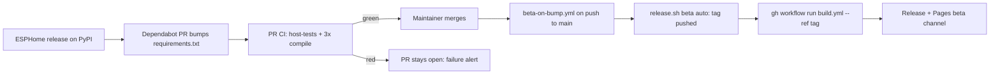

# Automated ESPHome updates → beta releases

Date: 2026-10-03

## Goal

HeatWhisper changes rarely, but its firmware is only rebuilt when a release is cut, so it silently
falls behind ESPHome. Keep the underlying ESPHome (and CI actions) current with minimal upkeep:

- A new stable ESPHome release produces a PR automatically.
- The maintainer reviews and merges it (the only manual gate).
- Merging automatically builds and publishes a **beta** (GitHub Release + Pages beta channel).
- Promotion beta → stable stays manual (`scripts/release.sh stable ...`).

## Non-goals

- No fully unattended releases; no auto-merge.
- No runtime/hardware testing (CI proves tests + config + compile only).
- No automatic stable promotion or reminders (possible follow-up).
- No ESPHome pre-release (beta/dev channel) canary.

## Background / constraints

- [build.yml](../../../.github/workflows/build.yml) runs on `push` and `pull_request`, currently with an
  **unpinned** `pip install esphome`. Jobs: `host-tests`, `compile` (3 boards), and tag-gated
  `release` / `pages` (`startsWith(github.ref, 'refs/tags/v')`, `-beta` selects the beta channel).
- [scripts/release.sh](../../../scripts/release.sh) creates and pushes `vX.Y.Z` / `vX.Y.Z-beta.N` tags
  (`DRY_RUN=1` prints the tag only).
- GitHub does not start workflow runs from events caused by `GITHUB_TOKEN` (including tag pushes);
  `workflow_dispatch` / `repository_dispatch` are exempt.
- `main` will be branch-protected soon (required checks, possibly required approvals).

## Design

### Components

| Unit | Responsibility |
|---|---|
| `requirements.txt` | Single source of truth for the ESPHome version: `esphome==X.Y.Z` |
| `.github/dependabot.yml` | Weekly `pip` and `github-actions` update PRs |
| `build.yml` (modified) | Install from `requirements.txt`; add `workflow_dispatch` trigger |
| `.github/workflows/beta-on-bump.yml` (new) | On merge of an ESPHome bump: create beta tag, dispatch `build.yml` on it |
| `scripts/release.sh` (modified) | New `beta auto` mode choosing the right beta base |

### Flow

### 1. Pinning (`requirements.txt`, `build.yml`)

- `requirements.txt` contains only `esphome==<current stable>` (pytest stays installed separately by
  `host-tests`).
- The `compile` job runs `pip install -r requirements.txt` (optionally `cache: pip` in `setup-python`).
- `release.sh` and the README developer notes reference the pinned version. `release.sh` keeps using the
  locally installed `esphome`; the README tells developers to `pip install -r requirements.txt`.
- `build.yml` triggers become `push`, `pull_request`, `workflow_dispatch`. No other job logic changes;
  with `--ref <tag>` dispatch, `GITHUB_REF` is the tag, so the existing release/pages guards and
  `-beta` channel detection work unchanged.

### 2. Dependabot (`.github/dependabot.yml`)

- Ecosystems: `pip` (directory `/`, weekly) and `github-actions` (directory `/`, weekly).
- Stable releases only (Dependabot's default); each ESPHome release, including patch releases, gets a PR
  whose body carries upstream release notes. Grouping is deliberately not configured initially.
- Dependabot PRs trigger `pull_request` CI normally; CI uses no secrets, so Dependabot's restricted
  token is sufficient.
- Not a scheduled workflow, so GitHub's 60-day inactivity auto-disable does not apply.

### 3. Beta on merge (`beta-on-bump.yml`)

- Trigger: `push` to `main` with `paths: [requirements.txt]`. A merge by the maintainer triggers
  workflows normally. A manual edit of the pin also publishes a beta, which is intended.
- Permissions: `contents: write` (push tag), `actions: write` (dispatch).
- `concurrency` group to serialize runs.
- Steps: checkout with `fetch-depth: 0`; `setup-python`; `pip install pytest -r requirements.txt` (the
  script needs both); run `scripts/release.sh beta auto` (it also re-runs pytest and `esphome config` as
  it does today); capture the created tag; `gh workflow run build.yml --ref "$TAG"`.
- `build.yml` on the tag compiles again and publishes through the existing `release` and `pages` jobs.
  The duplicate compile is accepted (public repo, free minutes) in exchange for reusing the
  existing publish path unchanged.
- Tag creation is not blocked by branch protection. If tag protection rules are added later they must
  allow the workflow.

### 4. `release.sh beta auto`

Choose the beta base from the highest existing version tag:

1. Find the highest base version `X.Y.Z` across all `vX.Y.Z` and `vX.Y.Z-beta.N` tags (`sort -V`).
2. If no stable tag `vX.Y.Z` exists for it (a beta series is in progress), base = `vX.Y.Z`.
3. Otherwise (latest is released), base = next patch (`vX.Y.(Z+1)`).
4. Tag = `base-beta.N` with the smallest unused `N` (existing loop).
5. No tags at all: fall back to `v0.1.0` as the existing beta path does.

Rationale: after `v0.2.0` is released, the current behaviour yields `v0.2.0-beta.19`, which sorts below
the stable release; and it must not start a stray `v0.2.1-beta.1` while a `v0.3.0-beta.x` series is open.
`release.sh` must print the final tag so the workflow can use it (in `DRY_RUN=1` it already does; in
normal mode the last output line is `released <tag>`).

Existing `beta [X.Y.Z]` and `stable ...` modes and their validation are unchanged.

## Error handling

| Situation | Behaviour |
|---|---|
| New ESPHome breaks tests/config/compile | Dependabot PR is red and stays open; nothing is merged or released |
| Newer ESPHome arrives while a PR is open | Dependabot updates or supersedes its PR |
| Beta tag already exists | `release.sh` picks the next `N`; if tag creation fails the workflow fails visibly |
| `release.sh` checks fail on `main` after merge | Workflow fails, no tag, no release (maintainer notified by Actions) |
| Tag build fails | No release/Pages deploy (existing `needs: compile` gating) |

## Testing

- Extend the `release.sh` tests (existing isolated temp git repo + `DRY_RUN=1` style) for `beta auto`:
  - latest stable only (`v0.2.0`) → `v0.2.1-beta.1`;
  - open series (`v0.3.0-beta.2`, no `v0.3.0`) → `v0.3.0-beta.3`;
  - betas of a released version present (`v0.2.0` + `v0.2.0-beta.18`) → `v0.2.1-beta.1`;
  - no tags → `v0.1.0-beta.1`.
- Source-level tests (matching the existing `build.yml` string-assert style) that `build.yml`
  has `workflow_dispatch` and installs from `requirements.txt`, `beta-on-bump.yml` triggers on
  `requirements.txt` and dispatches `build.yml`, and `dependabot.yml` lists both ecosystems.
- Existing tests that read `build.yml` (`test_fw_version.py`, `test_final_fixes.py`,
  `test_ota_manifest.py`) must keep passing.
- First real verification: trigger `beta-on-bump.yml` path once with a manual pin change (or the first
  Dependabot PR) and confirm the beta lands on the Pages beta channel.

## Manual setup (outside the repo)

- When protecting `main`: require the `host-tests` and `compile` checks. If approvals are required, the
  maintainer approves the Dependabot PR.
- Confirm Actions has write permission for workflow tokens (needed for tag push); tag protection
  rules, if any, must permit the workflow.

## Known limitations

- A merged bump publishes a beta of all of `main`, including unreleased work.
- Every ESPHome patch release yields a PR (and, once merged, a beta).
- Compile success does not prove runtime correctness; beta soak and manual stable promotion remain the
  safety net.
